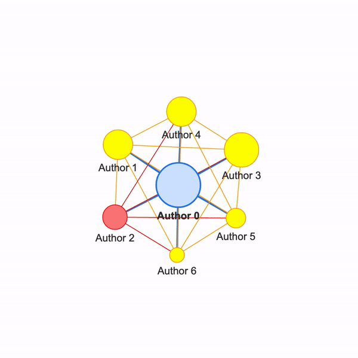

# Social Dynamics and the Evolution of Disciplines
A model of the long-term evolution of sciencific disciplines with the dynamics of collaboration and reputation. Initial model drew from finding in [this Social Dynamics of Science Paper](https://www.nature.com/articles/srep01069). 



## Brief Explanation
We consider the long-term evolution of science and show how a "contagion of disrespect" – an increasing dismissal of research in subfields associated with marginalized groups – can arise due to the dynamics of collaboration and reputation (versus, e.g., preconceived notions of the field’s worth). This has implications both for how we understand the history of science and for how we attempt to promote diverse scientific inquiry.

## Running the Model
Reference **main.py** to see how to declare an instance of the **Evolution** class and run a model. With the default parameters, a model can be run and saved with the following code:
```
from modules.Evolution import Evolution

env = Evolution()
env.evolve(timeSteps=10)
env.saveEvolutionWithPickle('outputs/evolution.env')
```

The evolve method determines how many time steps to run the model. Then, the saved **Evolution** class can be loaded into a Jupyter Notebook, where the network visualizations can be viewed.

To run the base model (from the original paper) instead of the new model implemented in this paper, simply add the argument baseModel=True in the evolve method:
```env.evolve(timeSteps=10, baseModel=True)```

## Organization
* **modules**: Contains the main classes for the models
    * **Evolution.py**: contains the main model class that defines how the scientific collaboration evolves over time.
    * **ScholarNetwork.py**: contains the scholar network class, which extends from the `networkx.Graph` class.
    * **Author.py**: class that defines an authors node.
    * **Paper.py**: class that contains data and methods for papers, expanding the base model.
    * **Topic.py**: class that contains data and methods for topics, expanding the base model.
    * **Type.py**: class that contains the data and methods for types, introduced in this new model.
    * **HTMLPage.py**: class that extends the Evolution class to generate an HTML page with the corresponding outputs. Not an essential class for the model, just useful for visualizing outputs in one place.
* **outputs**: Contains example **Evolution** data structures, **ScholarNetworks**, and network visualizations from models that have been run. 
* **new-model.py**: Python script that declares an instance of our new model and runs it.
* **modelReplication.py**:  Script that uses multithreading to run multiple models, combining their data and generating plots at the end using the HTMLPage class.
* **viewEvolution.ipynb**: Example python notebook that shows the output of various evolution models.

## Interactive Network Visualizations
Interactive network visualizations can be generated by [Pyvis](https://pyvis.readthedocs.io/en/latest/index.html) using the `ScholarNetwork.plotPyvisGraph()` method. Using [these Pyvis properties](https://visjs.github.io/vis-network/docs/network/nodes.html ), the nodes will be scaled to represent how many papers the author has published.
    
Todo: Edges with thickness for how many they have done together

## CSV File Format
(Top right) distribution1 : array_like
    Input data. The histogram is computed over the flattened array. Values for the Network Type Distribution. It would be the histogram values.
(bottom right) distribution of credit with the type name: Network credit distribution per type
    credit-distrib-{TypeName}
(bottom left)
    percent-marginalized-x
    avg-credit-y

## Dependencies
* [Networkx](https://networkx.org/) for structuring the base network class for the new [scholar network](https://github.com/kekoawong/scienceDynamicsModel/tree/main/modules/ScholarNetwork.py).
* [iGraph](https://igraph.org/python/) for splitting communities based on the [leading eigenvector method](https://igraph.org/python/api/latest/igraph.Graph.html#community_leading_eigenvector).
* [Python-louvain](https://python-louvain.readthedocs.io/en/latest/) for detecting communities with modularity measures.
* [Pyvis](https://pyvis.readthedocs.io/en/latest/index.html) for interactive network visualizations.
* [Matplotlib](https://matplotlib.org/) for simple network visualizations.
* [Pickle](https://docs.python.org/3/library/pickle.html) for saving and loading models.
* [Pandas](https://pandas.pydata.org/) for data processing.