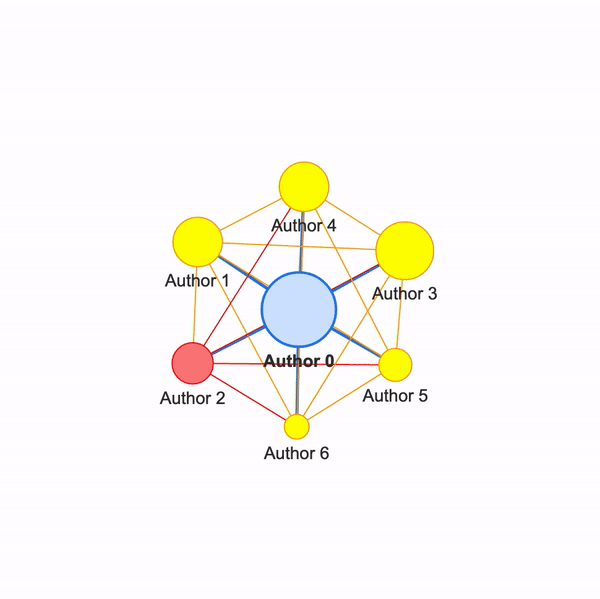

# Science Dynamics Model
This repository contains the code for is based upon [this Social Dynamics of Science Paper](https://www.nature.com/articles/srep01069) which modeled the birth and decline of scientific disciplines. 



## Brief Explanation
At every time step, new authors and papers are added to the network. Each paper has a certain number of topics associated with it. An author's discipline corresponds to the topics that contain the most papers for the given author.

## Running the Model
Reference **main.py** to see how to declare an instance of the **Evolution** class and run a model. With the default parameters, a model can be run and saved with the following code:
```
from modules.Evolution import Evolution

env = Evolution()
env.evolve(timeSteps=10)
env.saveEvolutionWithPickle('outputs/evolution.env')
```

The evolve method determines how many time steps to run the model. Then, the saved **Evolution** class can be loaded into a Jupyter Notebook, where the network visualizations can be viewed.

## Organization
* **modules**: Contains the main classes for the models
    * **Evolution.py**: contains the main model class that defines how the scientific collaboration evolves over time.
    * **ScholarNetwork.py**: contains the scholar network class, which extends from the `networkx.Graph` class.
* **outputs**: Contains example **Evolution** data structures, **ScholarNetworks**, and network visualizations from models that have been run. 
* **main.py**: Example python script that declares an instance of an science evolution model and runs it.
* **viewEvolution.ipynb**: Example python notebook that shows the output of various evolution models.


## Data Structures
Within the model, there are existing data structures that are updated for **Authors**, **Papers**, and **Topics**. 
**Authors** will be stored in the `ScholarNetwork` class, with the following format:
```
{
    TopicID1: [PaperIDs],
    TopicID2: [PaperIDs],
}
```

**Papers** will be stored in the `Evolution` class with the following format:

```
{
    PaperID1: ([TopicIDs], [AuthorIDs]),
    PaperID2: ([TopicIDs], [AuthorIDs]),
}
```

**Topics** will also be stored in the `Evolution` class with the following format:
```
{
    TopicID1: [PaperIDs],
    TopicID2: [PaperIDs]
}
```

## Interactive Network Visualizations
Interective network visualizations can be generated by [Pyvis](https://pyvis.readthedocs.io/en/latest/index.html) using the `ScholarNetwork.plotPyvisGraph()` method. Using [these Pyvis properties](https://visjs.github.io/vis-network/docs/network/nodes.html ), the nodes will be scaled to represent how many papers the author has published.
    
Todo: Edges with thickness for how many they have done together

## Dependencies
* [Networkx](https://networkx.org/) for structuring the base network class for the new [scholar network](https://github.com/kekoawong/scienceDynamicsModel/tree/main/modules/ScholarNetwork.py).
* [iGraph](https://igraph.org/python/) for splitting communities based on the [leading eigenvector method](https://igraph.org/python/api/latest/igraph.Graph.html#community_leading_eigenvector).
* [Python-louvain](https://python-louvain.readthedocs.io/en/latest/) for detecting communities with modularity measures.
* [Pyvis](https://pyvis.readthedocs.io/en/latest/index.html) for interactive network visualizations.
* [Matplotlib](https://matplotlib.org/) for simple network visualizations.
* [Pickle](https://docs.python.org/3/library/pickle.html) for saving and loading models.